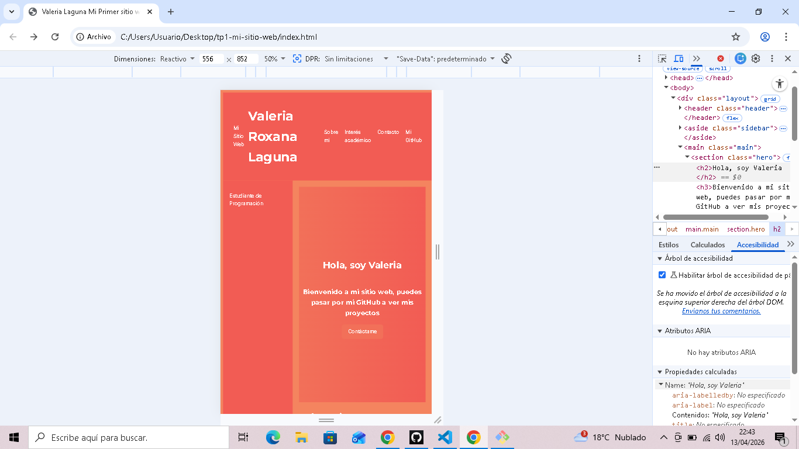
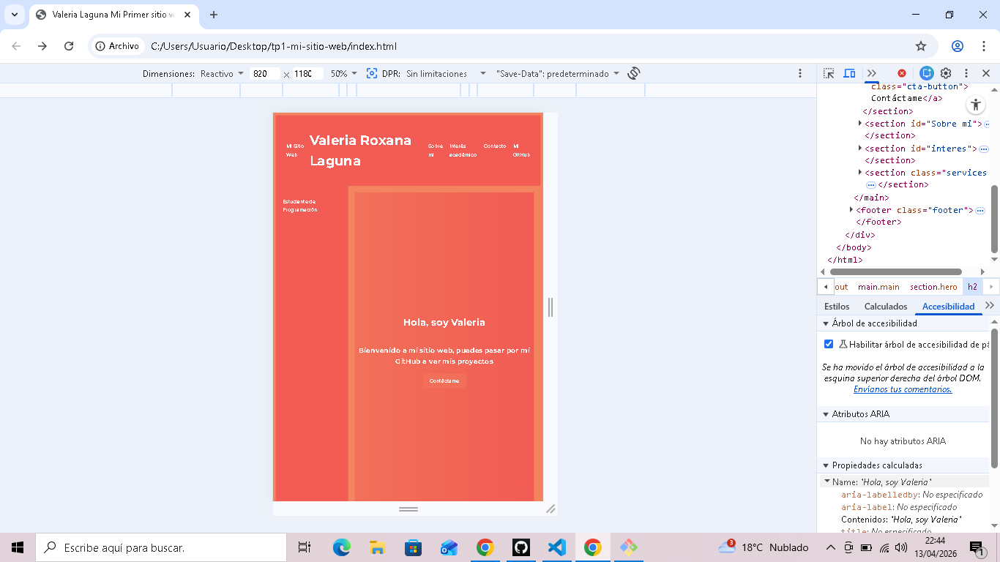

## Datos
Nombre: Valeria Laguna
TP Número: 1
Fecha: 2026-04-06

## Descripción del Sitio Web
Este es mi primer sitio web, donde muestro información sobre mí y mis intereses.

## Tecnologías Usadas
- HTML5
- CSS3

## Reflexión
Aprender a usar la terminal es fundamental porque permite un mayor control y eficiencia al manejar archivos y ejecutar comandos.
La interfaz gráfica puede ser intuitiva, pero la terminal ofrece herramientas poderosas para automatizar tareas y realizar acciones más rápidas. 
La ruta donde se instaló Git en mi sistema es: /mingw64/bin/git
## mi sitio
https://valerialaguna99.github.io/tp1-mi-primer-sitio/
## github
https://github.com/ValeriaLaguna99/tp1-mi-primer-sitio.git

## Mobile:

## Tablet:

## Desktop:

